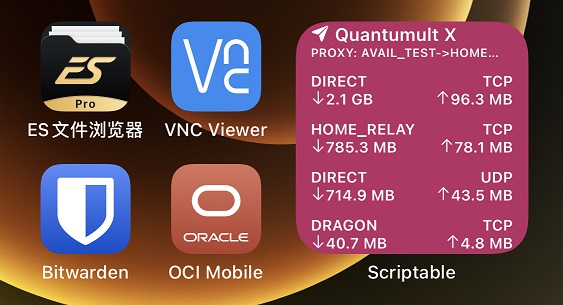

# Quantumult X 小组件示例



## 订阅链接
```
# [rewrite_remote]
# https://raw.githubusercontent.com/lanceliao/quan/main/quan_api/quan_api.conf, tag=Quan.API, update-interval=18400, enabled=true
```

## API测试
在Safari浏览器打开链接: [http://quan.api/v1/status](http://quan.api/v1/status)

## Scriptable小组件
在Scriptable App导入小组件代码: [quan_status_widget.js](./quan_status_widget.js)

